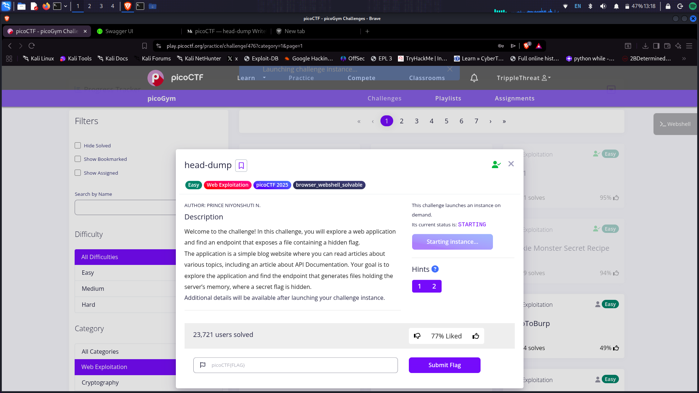
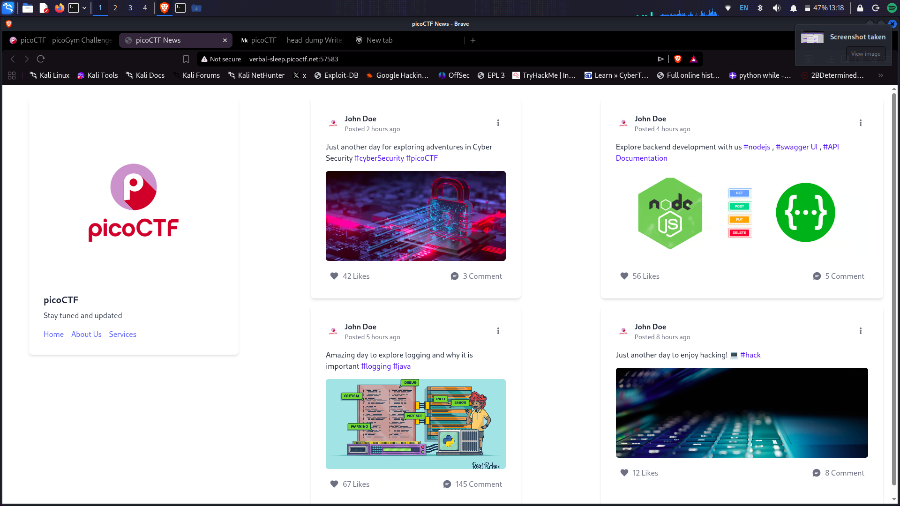
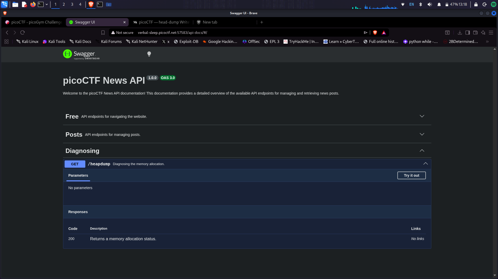
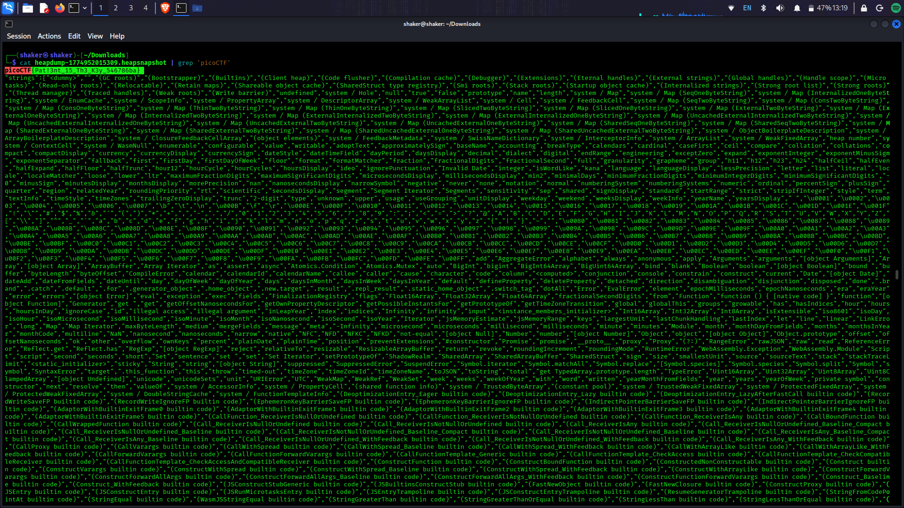

# head-dump - PicoCTF 2025

**Platform:** PicoCTF  
**Category:** Web Exploitation  
**Difficulty:** Easy  
**Points:** 50  
**Date Solved:** March 29, 2026  
**Author:** Alvin.

---

## 📋 Challenge Description

Welcome to the challenge! In this challenge, you will explore a web application and find an endpoint that exposes a file containing a hidden flag.

The application is a simple blog website where you can read articles about various topics, including an article about API Documentation. Your goal is to explore the application and find the endpoint that generates files holding the server's memory, where a secret flag is hidden.

**Challenge URL:** http://verbal-sleep.picoctf.net:57583/  
**Files Provided:** None

---

## 🎯 Introduction

In picoCTF 2025's **head-dump** challenge, participants are tasked with uncovering a hidden flag buried within a server's memory dump. This 50-point web exploitation problem tests your ability to:

- Navigate API documentation
- Identify critical endpoints
- Extract secrets from unstructured data

The challenge simulates real-world scenarios where **misconfigured APIs** or **debugging tools** can expose sensitive information, making it a valuable exercise for aspiring cybersecurity professionals.

**Real-World Context:**  
Memory dumps and heap snapshots are often used for debugging production issues, but if exposed publicly, they can leak:
- API keys and secrets
- User credentials
- Session tokens
- Database connection strings
- Internal application state

---

## 🔍 Initial Reconnaissance

### First Observations


*Challenge landing page showing the blog interface*

- Landing page is a simple blog website
- Multiple articles about cybersecurity topics
- Posts from user "John Doe" about various topics:
  - Cyber Security (#cyberSecurity #picoCTF)
  - Backend development with #nodejs, #swagger UI, #API Documentation
  - Logging and #java
  - Hacking (#hack)
- One article specifically mentions: **"Explore backend development with us #nodejs, #swagger UI, #API Documentation"**
- This was a clear hint pointing to API documentation

### Tools Used
- Web browser (Firefox/Brave)
- `grep` command-line tool
- Chrome/Firefox DevTools (for heap snapshot analysis)

### Information Gathered

The article mentioning **Swagger UI** and **API Documentation** was the key hint. Swagger (OpenAPI) is a standard for documenting REST APIs and typically provides an interactive interface for testing endpoints.

---

## 🚀 Exploitation Process

### Step 1: Exploring the Web Application


*Blog posts showing the hint about API Documentation*

**Actions taken:**
- Navigated through all blog posts
- Clicked on the **API Documentation** article
- Noticed it redirected to `/api-docs/#/`

**Key Finding:**  
The `/api-docs` endpoint hosted **Swagger UI**, a tool for visualizing and interacting with REST APIs.

---

### Step 2: Identifying the Critical Endpoint


*Swagger UI showing the /heapdump endpoint under Diagnosing section*

**Swagger UI Analysis:**

The API documentation revealed several endpoint categories:
- **Free** - API endpoints for navigating the website
- **Posts** - API endpoints for managing posts
- **Diagnosing** - Memory diagnostic endpoints ⚠️

Under the **Diagnosing** section, I found:
```
GET /heapdump
Description: Diagnosing the memory allocation.
Parameters: No parameters
Response: 200 - Returns a memory allocation status
```

**Why this endpoint is suspicious:**
- Memory dumps can contain sensitive data
- Publicly accessible diagnostic endpoints are a security risk
- The challenge name "head-dump" directly references this
- No authentication required

---

### Step 3: Executing the Endpoint

**Method 1: Using Swagger UI's "Try it out" feature**


*Clicking "Try it out" on the /heapdump endpoint*

**Actions:**
1. Clicked **"Try it out"** button
2. Clicked **"Execute"** 
3. Server generated and returned a `.heapsnapshot` file
4. Downloaded the heap snapshot

**File Details:**
- **Filename:** `heapdump-[timestamp].heapsnapshot`
- **Size:** ~177 MB (very large!)
- **Format:** Chrome V8 heap snapshot (JSON format)

**Method 2: Direct URL access**
```bash
curl -O http://verbal-sleep.picoctf.net:57583/heapdump
```

---

### Step 4: Analyzing the Heap Snapshot

**Challenge:** The heap snapshot is massive (177 MB+) containing:
- JavaScript objects
- Strings
- Function definitions
- System memory state
- Application variables

**Approach 1: Manual analysis (not recommended)**
- Load into Chrome DevTools → Memory → Load heap snapshot
- Search through millions of objects
- Time-consuming and impractical

**Approach 2: Command-line search (RECOMMENDED)**


*Using grep to search for the flag in the heap snapshot*

```bash
# Search for the flag pattern
cat heapdump-177695261353909.heapsnapshot | grep 'picoCTF'
```

**Why this works:**
- The flag follows the format `picoCTF{...}`
- `grep` efficiently searches large text files
- The heap snapshot is JSON text, not binary
- Flags are stored as strings in memory

---

### Step 5: Extracting the Flag

**Command used:**
```bash
cat heapdump-177695261353909.heapsnapshot | grep 'picoCTF'
```

**Output:**
```
picoCTF{h34p_dump_15_ju57_4_f1l3_cr7560d1}
```

**Success!** The flag was found embedded in the server's memory dump.

---

## 💡 Solution Summary

### Complete Attack Chain

**1. Reconnaissance**
```
Browse website → Find API Documentation hint → Discover Swagger UI
```

**2. Endpoint Discovery**
```
Navigate to /api-docs → Explore Diagnosing section → Find /heapdump
```

**3. Exploitation**
```
Execute /heapdump endpoint → Download .heapsnapshot file (177 MB)
```

**4. Flag Extraction**
```bash
grep 'picoCTF' heapdump-*.heapsnapshot
```

### Flag
```
picoCTF{h34p_dump_15_ju57_4_f1l3_cr7560d1}
```

**Flag Translation:** "heap dump is just a file" (cr7560d1 - random suffix)

---

## 📖 Key Learnings

### Technical Concepts

**Heap Snapshots:**
- Capture of program memory at a specific point in time
- Used for debugging memory leaks in Node.js/V8 applications
- Contains all objects, strings, and data structures in memory
- Format: JSON representation of V8 heap

**V8 Engine:**
- JavaScript engine used by Node.js and Chrome
- Provides heap snapshot functionality for debugging
- `.heapsnapshot` files can be analyzed with Chrome DevTools

**API Documentation Security:**
- Swagger/OpenAPI should not expose sensitive debugging endpoints
- Diagnostic endpoints should require authentication
- Production APIs should not include debug routes

**Memory Dump Risks:**
- Can contain secrets, API keys, passwords
- Session tokens and user data
- Database credentials
- Internal application logic
- Debugging information

### Real-World Security Implications

**This vulnerability represents:**

1. **Information Disclosure (CWE-200)**
   - Sensitive data exposed through memory dumps
   - OWASP A01:2021 - Broken Access Control

2. **Insufficient Access Control**
   - Debug endpoints publicly accessible
   - No authentication on sensitive operations

3. **Common Misconfigurations:**
   - Leaving debug endpoints in production
   - Exposing Swagger UI without access control
   - Not sanitizing memory dumps before exposure

**Real-world examples:**
- Companies have leaked API keys via heap dumps
- Debug endpoints exposing customer data
- Memory dumps containing authentication tokens

### New Techniques Learned

1. **API Documentation Reconnaissance** - Using Swagger UI to discover hidden endpoints
2. **Heap Snapshot Analysis** - Understanding V8 heap snapshots and their structure
3. **Efficient Large File Searching** - Using `grep` for massive JSON files instead of manual analysis
4. **Memory Forensics Basics** - Extracting secrets from application memory

### Attack Strategy

**For similar challenges:**
1. Look for hints about API documentation (Swagger, OpenAPI, Postman)
2. Always explore `/api-docs`, `/swagger`, `/docs` endpoints
3. Check for debug/diagnostic endpoints (heap dumps, thread dumps, metrics)
4. Use command-line tools for large file analysis
5. Search for flag patterns efficiently with `grep`, `strings`, etc.

---

## 🔄 Alternative Solutions

### Method 1: Chrome DevTools Memory Profiler

**Steps:**
1. Open Chrome DevTools (F12)
2. Go to **Memory** tab
3. Click **"Load"** at bottom
4. Select the `.heapsnapshot` file
5. Use **Search** functionality to find "picoCTF"

**Pros:**
- Visual interface
- Can explore memory structure
- See object relationships

**Cons:**
- Slow to load large files (177 MB)
- Takes significant time to parse
- GUI can crash with large dumps

---

### Method 2: Using `strings` Command

```bash
# Extract all printable strings
strings heapdump-177695261353909.heapsnapshot | grep picoCTF
```

**Why this works:**
- `strings` extracts printable ASCII/Unicode text
- Faster than loading entire JSON
- Works on any text/binary file

---

### Method 3: Using `jq` for JSON Parsing

```bash
# Parse JSON and search for flag
jq '. | tostring' heapdump-177695261353909.heapsnapshot | grep picoCTF
```

**Advantage:**
- Proper JSON parsing
- Can extract specific fields
- More structured approach

---

### Method 4: Python Script

```python
#!/usr/bin/env python3
import json
import re

# Read heap snapshot
with open('heapdump-177695261353909.heapsnapshot', 'r') as f:
    content = f.read()

# Find flag
flag = re.search(r'picoCTF\{[^}]+\}', content)
if flag:
    print(f"[+] Flag found: {flag.group()}")
else:
    print("[-] Flag not found")
```

**Usage:**
```bash
python3 extract_flag.py
```

---

### Method 5: Automated One-Liner

```bash
# Download and extract flag in one command
curl -s http://verbal-sleep.picoctf.net:57583/heapdump | grep -oP 'picoCTF\{[^}]+\}'
```

**Perfect for automation and scripting!**

---

## 💻 Commands & Scripts Used

### Useful One-Liners

```bash
# Download heap dump
curl -O http://TARGET/heapdump

# Search for flag
grep 'picoCTF' heapdump-*.heapsnapshot

# Search with regex
grep -oP 'picoCTF\{[^}]+\}' heapdump-*.heapsnapshot

# Extract all strings and search
strings heapdump-*.heapsnapshot | grep picoCTF

# Count occurrences
grep -c 'picoCTF' heapdump-*.heapsnapshot

# Search case-insensitive
grep -i 'flag' heapdump-*.heapsnapshot

# Show surrounding context
grep -C 3 'picoCTF' heapdump-*.heapsnapshot
```

## 🎓 Recommendations for Similar Challenges

**When encountering web applications:**

1. **Always explore API documentation**
   - Check `/api-docs`, `/swagger`, `/docs`, `/swagger-ui`
   - Look for Swagger UI, ReDoc, or similar tools
   - Test all documented endpoints

2. **Look for debug/diagnostic endpoints**
   - `/debug`, `/metrics`, `/health`, `/status`
   - `/heapdump`, `/threaddump`, `/memory`
   - `/actuator/*` (Spring Boot)
   - These should NEVER be public!

3. **Read all blog posts/comments carefully**
   - Hints are often embedded in content
   - Look for mentions of technologies (Swagger, APIs, etc.)
   - Follow suspicious links

4. **Use efficient search tools**
   - `grep` for text search
   - `strings` for binary files
   - Don't try to manually parse huge files

5. **Understand common file formats**
   - `.heapsnapshot` = V8 heap dump (JSON)
   - `.hprof` = Java heap dump
   - `.dmp` = Windows memory dump

**Red flags to watch for:**

- Publicly accessible Swagger/API documentation
- Debug endpoints without authentication
- Heap dumps or thread dumps accessible
- Mentions of "diagnostic" or "monitoring" endpoints
- Stack traces or error pages revealing internals

---

## Documentation
- [V8 Heap Snapshots](https://v8.dev/blog/heap-snapshot)
- [Node.js Heap Dumps](https://nodejs.org/en/docs/guides/diagnostics/memory/using-heap-snapshot)
- [Swagger/OpenAPI Specification](https://swagger.io/specification/)
- [OWASP API Security Top 10](https://owasp.org/www-project-api-security/)

### Articles & Guides
- [OWASP A01:2021 - Broken Access Control](https://owasp.org/Top10/A01_2021-Broken_Access_Control/)
- [Analyzing Heap Snapshots](https://developer.chrome.com/docs/devtools/memory-problems/heap-snapshots/)
- [Securing Express APIs](https://expressjs.com/en/advanced/best-practice-security.html)

### Tools Used
- **grep** - Text search utility
- **curl** - HTTP client
- **Chrome DevTools** - Memory profiler
- **Swagger UI** - API documentation interface

---

## 📸 Screenshots

### 1. Challenge Page

*Initial challenge page with blog posts*

### 2. Blog Posts with Hint

*John Doe's post mentioning API Documentation*

### 3. Swagger UI Interface

*Swagger UI showing the /heapdump endpoint under Diagnosing*

### 4. Flag Extraction

*Using grep to extract the flag from the heap snapshot*

---

## 🏷️ Tags

`#web` `#api-security` `#heap-dump` `#swagger` `#memory-forensics` `#information-disclosure` `#debugging-tools` `#picoctf` `#easy`

---

**[← Back to Main Index](../../README.md)**
